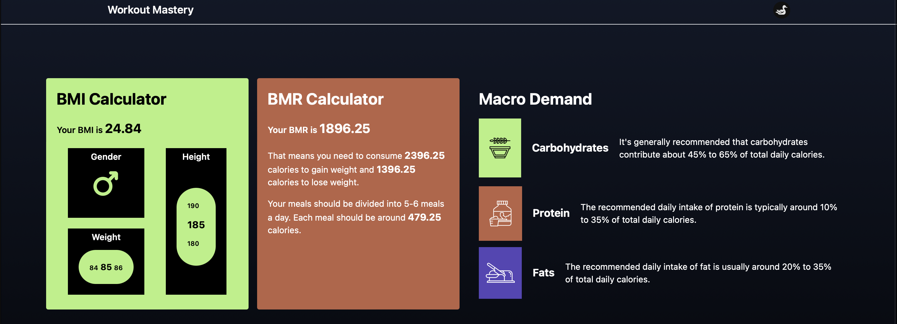
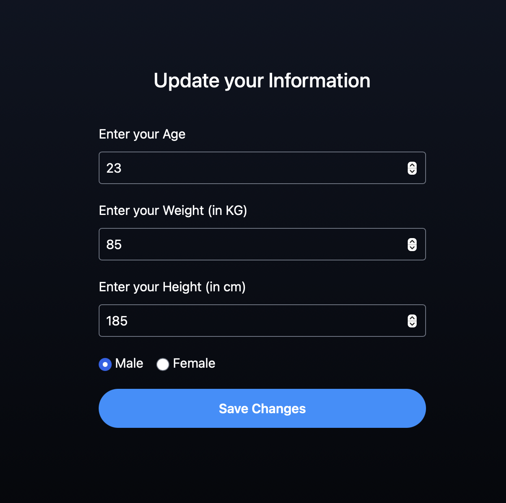

[![Contributors][contributors-shield]][contributors-url]
[![Forks][forks-shield]][forks-url]
[![Stargazers][stars-shield]][stars-url]
[![Issues][issues-shield]][issues-url]
[![LinkedIn][linkedin-shield]][linkedin-url]
<!-- [![MIT License][license-shield]][license-url] -->

# About The Project
WorkoutApp is a comprehensive tool that integrates functionality related to diet, physical activity, and overall well-being, allowing users to take a comprehensive approach to healthy living.

The app allows users to create an account and log in to personalize their workout and diet experience. In the account editing panel, users can enter data such as height, weight, gender, and age, which is key to providing personalized information.
The app offers a BMI (Body Mass Index) calculator that assesses weight-to-height ratios, helping users understand their current health situation. In addition, the BMR (Basal Metabolic Rate) calculator calculates basal metabolism which is the amount of energy required for the body's basic functions at rest. Based on this, the app also calculates basal caloric requirements and macronutrient ratios (proteins, carbohydrates, fats), allowing users to adjust their diets to meet their goals.

## Implemented functions:

- **Account creation/Login System:** Users can create accounts and log in, allowing them to personalize their training and diet experience.
- **Account edit panel:** Allows users to enter information such as height, weight, gender, and age, which is crucial for personalized data.
- **BMI Calculator:** An assessment of weight-to-height ratio, helping users understand their current health situation.
- **BMI Calculator:** Calculation of basal metabolism, which determines the amount of energy required for basic bodily functions at rest.
- **Basic Caloric Requirements and Macronutrients:** Provides information on basic caloric requirements and macronutrient ratios (proteins, carbohydrates, fats) based on user data.

## Planned expansions
The project plans to introduce two new panels:
- **Panel with recipes:** Will allow users to access healthy recipes according to their caloric needs and dietary preferences.
- **Exercise panel:** Will provide users with the ability to plan and execute a variety of workouts, taking into account their fitness level and goals.

### Technical elements of the application:
The application model consists of:
1. user interface, through which the user explores the visual elements of www.workoutapp.pl and interacts with the elements in the backend (Backend). More details about the user interface will be included in the User Story section.
2. Hosting is a service that involves providing server space for a website and its resources. It allows to publication of both a website and an application. It is based on sharing disk space on a physical server, which can be shared by multiple users simultaneously. The solution is just enough for our project needs.
3. PostgreSQL database, in which tables are relationally linked to each other through the use of Primary Keys, Foreign Keys, and Composite Keys.

### Flow of OAuth 2.0 Authentication

```mermaid
sequenceDiagram
    Client->>Authorization_Server: 1. Request Authorization
    Authorization_Server-->>Client: 2. Authorization Grant
    Client->>Authorization_Server: 3. Request Access Token
    Authorization_Server-->>Client: 4. Access Token
    Client->>Resource_Server: 5. Resource Request with Access Token
    Resource_Server-->>Authorization_Server: 6. Access Token Validation
    Resource_Server-->>Client: 7. Access to Protected Resources
```
1. **Client** requests authorization from the **Authorization Server**:
   - Authorization request includes identity and credentials.

2. **Authorization Server** provides Authorization Grant to the **Client**:
   - Authorization Grant is sent back to the **Client**.

3. **Client** requests an Access Token from the **Authorization Server**:
   - Access Token request includes the Authorization Grant.

4. **Authorization Server** sends an Access Token to the **Client**:
   - Access Token is sent back to the **Client**.

5. **Client** sends a Resource request to the **Resource Server** along with the Access Token:
   - Resource request includes the Access Token.

6. **Resource Server** communicates with the **Authorization Server** to validate the Access Token:
   - Access Token validation and verification process occur between the **Resource Server** and the **Authorization Server**.

7. **Resource Server** grants access to Protected Resources to the **Client** based on token validation:
   - Access is granted if the Access Token is valid.

### Network model

```mermaid
flowchart TD
    A[User] <-->|Login| B(Domain)
    B <--> C{Hosting}
    C <-->|request| D[DB]
```
1. **User** starts a link with the target server. The client connects via a registered domain name to www.workoutapp.pl.
   - **User** login or create a new account request.
   - After completing login/signup the resources are visible for the **User**
2. **Hosting** is a part of the server, dedicated with allocated parameters that are also a dedicated part of the server's power and capacity
   - **User** can use all the allocated resources of the machine: all its computing power, RAM, or disk space. For our project needs, we do not need more than just some resources of the one machine that connects to the database.
3. The machine connects with **DB** and through requests demands and receives the required data

# Class Diagrams

```mermaid
classDiagram
  class User {
    +email: string
    +encrypted_password: string
    +reset_password_token: string
    +reset_password_sent_at: datetime
    +remember_created_at: datetime
    +created_at: datetime
    +updated_at: datetime
    +gender: string
    +age: integer
    +weight: integer
    +height: integer
    +VALID_GENDERS: Array<string>
    +bmi_calculator(): BmiCalculator
    +bmr_calculator(): BmrCalculator
    +male?(): boolean
    +female?(): boolean
  }

  class BmiCalculator {
    +initialize(user: User): void
    +bmi(): number
    +underweight?(): boolean
    +overweight?(): boolean
  }

  class BmrCalculator {
    +initialize(user: User): void
    +bmr(): number
  }

  User -- BmiCalculator: has
  User -- BmrCalculator: has
```

# User story
As a registered user of the workout website,

I want to be able to update my personal information such as width and height on my profile
so that the fitness calculations are accurate and tailored to my specific body metrics.

## Scenario 1: Updating Profile Information

1. Given that I am logged into the workout website, when I navigate to the "Edit Profile" section,
then I should see fields to input my width and height.
2. When I input my width and height values, and click the "Save" button,
then my profile information should be successfully updated with the new values.
3. If I input invalid or inappropriate values (e.g., negative values, non-numeric characters),
then I should receive a clear error message guiding me to input valid data.

## Scenario 2: Accessing BMR Calculator

1. Given that I am logged into the workout website and have updated my profile information,
when I navigate to the "BMR Calculator" section,
then I should be able to access the calculator to determine my Basal Metabolic Rate (BMR).
2. After inputting any required data, such as age, gender, and activity level,
when I click the "Calculate" button,
then the website should display my BMR value accurately based on the entered information.
3. If I input incomplete or invalid data into the BMR calculator,
then I should receive clear error messages guiding me to provide the necessary information.

## Scenario 3: Accessing BMI Calculator

1. Given that I am logged into the workout website and have updated my profile information,
when I navigate to the "BMI Calculator" section,
then I should be able to access the calculator to determine my Body Mass Index (BMI).
2. After inputting my weight and height, when I click the "Calculate" button,
then the website should display my BMI value accurately based on the entered information.
3. If I input incomplete or invalid data into the BMI calculator,
then I should receive clear error messages guiding me to provide the necessary information.

## Built With

[![Ruby][Ruby]][Ruby-url]
[![Ruby-on-rails][Ruby-on-rails]][Ruby-on-rails-url]
[![Tailwind][Tailwind]][Tailwind-url]

## Setup

1. Pull down the app from version control
2. Install tool versions `asdf install`
3. `bundle install`
4. `bin/setup`
5. `rails db:seed`

## Running The App

1. `bin/dev`

## Tests and CI

1. `bin/ci`

## Technologies used
The application was built using:
- Programming language: Ruby
- Framework: Ruby on Rails
- Database: PostgreSQL

## Production

* All runtime configurations should be supplied
in the UNIX environment

<!-- MARKDOWN LINKS & IMAGES -->
[contributors-shield]: https://img.shields.io/github/contributors/PatRogala/elearning-platform.svg?style=for-the-badge
[contributors-url]: https://github.com/PatRogala/elearning-platform/graphs/contributors
[forks-shield]: https://img.shields.io/github/forks/PatRogala/elearning-platform.svg?style=for-the-badge
[forks-url]: https://github.com/PatRogala/elearning-platform/network/members
[stars-shield]: https://img.shields.io/github/stars/PatRogala/elearning-platform.svg?style=for-the-badge
[stars-url]: https://github.com/PatRogala/elearning-platform/stargazers
[issues-shield]: https://img.shields.io/github/issues/PatRogala/elearning-platform.svg?style=for-the-badge
[issues-url]: https://github.com/PatRogala/elearning-platform/issues
<!-- [license-shield]: https://img.shields.io/github/license/PatRogala/elearning-platform.svg?style=for-the-badge
[license-url]: https://github.com/PatRogala/elearning-platform/blob/master/LICENSE.txt -->
[linkedin-shield]: https://img.shields.io/badge/-LinkedIn-black.svg?style=for-the-badge&logo=linkedin&colorB=555
[linkedin-url]: https://linkedin.com/in/patrogala
[product-screenshot]: preview.png
[Ruby]: https://img.shields.io/badge/Ruby_3.2.0-D51F06?style=for-the-badge&logo=ruby&logoColor=white
[Ruby-url]: https://www.ruby-lang.org/en/
[Ruby-on-rails]: https://img.shields.io/badge/Rails_7.1.1-cc0000?style=for-the-badge&logo=RubyOnRails&logoColor=white
[Ruby-on-rails-url]: https://rubyonrails.org/
[Tailwind]: https://img.shields.io/badge/Tailwind_3-06b6d4?style=for-the-badge&logo=Tailwindcss&logoColor=white
[Tailwind-url]: https://tailwindcss.com/
